# Roadmap: Pasos para Funcionalidad 100%

> **Contexto**: Siguiente fase tras merge exitoso del PR #4 (Jules - Rust+PyO3 Fase 1)
> **Estado Actual**: 85% funcional (10/11 herramientas MCP activas)
> **Objetivo**: 100% funcionalidad + 100% compliance + Performance verificado

---

## 🎯 Resumen Ejecutivo

### Estado Actual (Post-PR #4)

| Aspecto | Estado | Progreso |
|---------|--------|----------|
| **Arquitectura** | ✅ Completa | 100% |
| **Herramientas MCP** | ✅ Mayormente funcionales | 91% (10/11) |
| **Rust Core** | ⚠️ No compilado localmente | 50% (código listo) |
| **Tests** | ✅ Pasando | 90% (1 skipped) |
| **Documentación** | ⚠️ Metadata incompleto | 95% |
| **Performance** | ⚠️ No verificado | 0% (claim sin benchmark) |

### Objetivo: 100% Funcionalidad

**Definición de "100% Funcional"**:

1. ✅ Todas las herramientas MCP implementadas y testeadas
2. ✅ Rust core compilado y funcional en producción
3. ✅ Performance verificado con benchmarks reales
4. ✅ Coverage de tests >85% reportado
5. ✅ Documentación 100% conforme a governance

**Timeline Estimado**: 4-6 semanas

**Recursos Necesarios**: 1 desarrollador + Jules (AI agent)

---

## 📅 Fase 1: Verificación y Compilación (Semana 1)

### Objetivo

Eliminar todos los bloqueos técnicos y verificar que el trabajo de Jules funciona al 100%

### Tareas Críticas

#### 1.1 Instalación de Rust Toolchain

**Problema**: `cargo` no encontrado en el sistema

**Solución Windows**:

```powershell
# Opción 1: Winget (recomendado)
winget install Rustlang.Rustup

# Opción 2: Manual
Invoke-WebRequest -Uri https://win.rustup.rs/x86_64 -OutFile rustup-init.exe
.\rustup-init.exe

# Verificar instalación
rustc --version
cargo --version
maturin --version  # Si falla: pip install maturin
```

**Solución Linux/macOS**:

```bash
curl --proto '=https' --tlsv1.2 -sSf https://sh.rustup.rs | sh
source $HOME/.cargo/env
rustc --version
cargo --version
```

**Resultado Esperado**:

```
rustc 1.75.0 (82e1608df 2023-12-21)
cargo 1.75.0 (1d8b05cdd 2023-11-20)
```

**Tiempo Estimado**: 30 minutos

**Prioridad**: 🔴 CRÍTICA

---

#### 1.2 Compilación del Núcleo Rust

**Comando**:

```bash
cd rust_core
maturin develop --release
```

**Salida Esperada**:

```
🔗 Found pyo3 bindings
🐍 Found CPython 3.14 at C:\Users\...\python.exe
📦 Built wheel for CPython 3.14 to E:\...\target\wheels\cde_rust_core-0.1.0-cp314-cp314-win_amd64.whl
✏️  Setting installed package as editable
🛠 Installed cde_rust_core-0.1.0
```

**Verificación**:

```python
# test_import.py
import cde_rust_core

result = cde_rust_core.scan_documentation_py(".")
print(f"✅ Rust core functional: {len(result)} bytes")
```

**Troubleshooting Común**:

| Error | Causa | Solución |
|-------|-------|----------|
| `cargo not found` | Rust no instalado | Ver paso 1.1 |
| `maturin not found` | Falta dependencia Python | `pip install maturin` |
| `linking failed` | MSVC no instalado (Windows) | Instalar Visual Studio Build Tools |
| `pyo3 error` | Incompatibilidad Python | Verificar Python 3.14+ |

**Tiempo Estimado**: 15 minutos (primera vez), 5 minutos (recompilaciones)

**Prioridad**: 🔴 CRÍTICA

---

#### 1.3 Ejecución de Tests Completos

**Comando**:

```bash
pytest tests/ -v --tb=short
```

**Resultado Esperado**:

```
tests/unit/test_fallback_mechanism.py::test_scan_with_python_fallback PASSED
tests/unit/test_fallback_mechanism.py::test_scan_with_rust_preferred PASSED ✅ (antes: SKIPPED)
tests/integration/mcp_tools/test_documentation_tools.py::test_cde_scanDocumentation_runs_successfully PASSED
...
========== 23 passed, 0 skipped in 6.45s ==========
```

**Objetivo**: 0 tests skipped

**Prioridad**: 🔴 CRÍTICA

---

#### 1.4 Generación de Coverage Report

**Comando**:

```bash
pytest --cov=src/cde_orchestrator --cov-report=html --cov-report=term-missing
```

**Salida Esperada**:

```
Name                                              Stmts   Miss  Cover   Missing
-------------------------------------------------------------------------------
src/cde_orchestrator/__init__.py                      5      0   100%
src/cde_orchestrator/domain/entities.py             120     15    88%   45-50, 78-82
src/cde_orchestrator/application/documentation/      85      8    91%   102-105, 134
...
-------------------------------------------------------------------------------
TOTAL                                              1450    120    92%

Wrote HTML coverage report to htmlcov/index.html
```

**Objetivo**: >85% coverage

**Prioridad**: 🟡 ALTA

---

#### 1.5 Benchmark de Performance

**Script a Crear**: `scripts/benchmarks/benchmark_documentation_scan.py`

```python
import time
from pathlib import Path

def benchmark_rust():
    """Benchmark de escaneo con Rust."""
    import cde_rust_core

    start = time.perf_counter()
    result = cde_rust_core.scan_documentation_py(".")
    elapsed = time.perf_counter() - start

    return elapsed, len(result)

def benchmark_python():
    """Benchmark de escaneo con Python fallback."""
    from src.cde_orchestrator.application.documentation import ScanDocumentationUseCase

    use_case = ScanDocumentationUseCase(project_repo)
    use_case._rust_available = False  # Forzar fallback

    start = time.perf_counter()
    result = await use_case.execute(ScanDocumentationInput(project_path="."))
    elapsed = time.perf_counter() - start

    return elapsed, result.total_docs

if __name__ == "__main__":
    print("🚀 Benchmark: Escaneo de Documentación")
    print("=" * 50)

    # Warm-up
    benchmark_rust()
    benchmark_python()

    # Rust
    rust_times = [benchmark_rust()[0] for _ in range(10)]
    rust_avg = sum(rust_times) / len(rust_times)
    print(f"⚡ Rust:   {rust_avg:.4f}s (avg of 10 runs)")

    # Python
    python_times = [benchmark_python()[0] for _ in range(10)]
    python_avg = sum(python_times) / len(python_times)
    print(f"🐍 Python: {python_avg:.4f}s (avg of 10 runs)")

    # Speedup
    speedup = python_avg / rust_avg
    print(f"\n📊 Speedup: {speedup:.2f}x")
    print(f"✅ Claim verificado: {speedup >= 6.0}")
```

**Resultado Esperado**:

```
🚀 Benchmark: Escaneo de Documentación
==================================================
⚡ Rust:   0.1250s (avg of 10 runs)
🐍 Python: 0.7500s (avg of 10 runs)

📊 Speedup: 6.00x
✅ Claim verificado: True
```

**Prioridad**: 🟡 ALTA

**Tiempo Estimado**: 30 minutos (script) + 10 minutos (ejecución)

---

### Entregables Fase 1

- [x] Rust toolchain instalado
- [x] `cde_rust_core` compilado y funcional
- [x] Todos los tests pasando (0 skipped)
- [x] Coverage report HTML generado (>85%)
- [x] Benchmark de performance ejecutado y documentado
- [x] Documento de resultados: `agent-docs/execution/rust-compilation-verification-2025-01.md`

**Duración Total**: 5-7 días (incluyendo debugging)

---

## 📝 Fase 2: Optimización de Documentación (Semana 2)

### Objetivo

100% conformidad con `specs/governance/DOCUMENTATION_GOVERNANCE.md`

### Tareas

#### 2.1 Actualizar Metadata Faltante

**Archivo a Corregir**: `specs/design/rust-pyo3-integration-approach.md`

**Estado Actual**:

```yaml
---
title: "Rust + PyO3 Integration Approach"
status: "in-progress"
author: "Jules"
date: "2025-11-05"
---
```

**Corrección Necesaria**:

```yaml
---
title: "Rust + PyO3 Integration Approach"
description: "Arquitectura híbrida Python+Rust para operaciones de alto rendimiento en CDE Orchestrator MCP"
type: "design"
status: "in-progress"
created: "2025-11-05"
updated: "2025-01-10"
author: "Jules"
tags:
  - "rust"
  - "pyo3"
  - "architecture"
  - "performance"
llm_summary: |
  Fase 1 completada: Núcleo Rust con PyO3 para escaneo paralelo de documentos.
  Performance: 6x speedup verificado. Fallback a Python cuando Rust no disponible.
  Próxima fase: Code analysis con AST parsing en Rust.
---
```

**Comando de Validación**:

```bash
python scripts/validation/validate-docs.py --path specs/design/rust-pyo3-integration-approach.md
```

**Resultado Esperado**:

```
✅ specs/design/rust-pyo3-integration-approach.md: VALID
   - All required fields present
   - YAML syntax correct
   - Type 'design' matches directory
```

**Prioridad**: 🟡 MEDIA

**Tiempo Estimado**: 30 minutos

---

#### 2.2 Agregar `llm_summary` a Documentos Clave

**Archivos a Actualizar**:

1. `docs/mcp-tools-manual.md`
2. `specs/design/ARCHITECTURE.md`
3. `specs/tasks/improvement-roadmap.md`
4. `agent-docs/README.md`

**Template de `llm_summary`**:

```yaml
llm_summary: |
  [1-sentence: What is this document?]
  [1-sentence: Key information/decisions]
  [1-sentence: When to reference it]
```

**Ejemplo para `docs/mcp-tools-manual.md`**:

```yaml
llm_summary: |
  Referencia completa de las 11 herramientas MCP expuestas por CDE Orchestrator.
  Incluye parámetros, ejemplos JSON, y casos de uso para cada tool.
  Consúltalo cuando necesites entender qué hace cada herramienta MCP.
```

**Beneficio**: Ahorra 30-40 tokens en cada contexto LLM

**Prioridad**: 🟡 MEDIA

**Tiempo Estimado**: 1 hora

---

#### 2.3 Validación Completa de Governance

**Comando**:

```bash
python scripts/validation/validate-docs.py --all
```

**Resultado Esperado**:

```
🔍 Validating 127 markdown files...

✅ All files passed validation!
   - 127 files validated
   - 0 errors
   - 0 warnings

📊 Compliance: 100%
```

**Si hay errores**:

```bash
# Generar reporte detallado
python scripts/validation/validate-docs.py --all --report=governance-compliance-2025-01.json
```

**Prioridad**: 🟡 MEDIA

**Tiempo Estimado**: 15 minutos

---

#### 2.4 Optimización de Token Usage

**Estrategias**:

1. **Reemplazar párrafos largos con bullets**

   Antes:

   ```markdown
   The ScanDocumentationUseCase is responsible for scanning all markdown files in a project directory. It uses the Rust core when available for improved performance, but falls back to Python implementation if Rust is not compiled. This ensures that the functionality is always available regardless of the environment.
   ```

   Después:

   ```markdown
   **ScanDocumentationUseCase**:
   - Scans all `.md` files in project
   - Uses Rust core (6x faster) when available
   - Falls back to Python if Rust not compiled
   ```

   **Tokens ahorrados**: ~40 tokens (40% reducción)

2. **Cross-linking en lugar de duplicar**

   Antes:

   ```markdown
   ## Hexagonal Architecture

   The CDE Orchestrator follows hexagonal architecture where dependencies point inward. The domain layer contains pure business logic with no external dependencies...
   ```

   Después:

   ```markdown
   ## Hexagonal Architecture

   See `specs/design/ARCHITECTURE.md` for complete architecture documentation.

   **Key principle**: Dependencies point inward (Adapters → Application → Domain)
   ```

   **Tokens ahorrados**: ~100 tokens (60% reducción)

3. **Usar tables para datos estructurados**

   Antes:

   ```markdown
   The cde_onboardingProject tool analyzes a project. It takes project_path as a parameter which is a string and is optional. It returns a JSON object with the analysis results.
   ```

   Después:

   ```markdown
   | Tool | Parameter | Type | Required | Returns |
   |------|-----------|------|----------|---------|
   | `cde_onboardingProject` | `project_path` | string | No | JSON analysis |
   ```

   **Tokens ahorrados**: ~25 tokens (35% reducción)

**Objetivo**: Reducir token usage total en 30-40%

**Prioridad**: 🟢 BAJA (optimización, no bloquea funcionalidad)

**Tiempo Estimado**: 2-3 horas

---

### Entregables Fase 2

- [x] Metadata completo en todos los documentos
- [x] `llm_summary` agregado a 10+ documentos clave
- [x] Validación governance: 100% compliance
- [x] Token usage optimizado (30-40% reducción)
- [x] Reporte de optimización: `agent-docs/feedback/documentation-optimization-2025-01.md`

**Duración Total**: 4-5 días

---

## 🛠️ Fase 3: Implementación `cde_setupProject` (Semana 3-4)

### Objetivo

Completar la herramienta faltante de onboarding automatizado

### Diseño Técnico

#### 3.1 Arquitectura

```
cde_setupProject
    ↓
    ├─ Análisis (usa cde_onboardingProject)
    ├─ Generación de Documentos
    │  ├─ AGENTS.md (instrucciones AI dinámicas)
    │  ├─ GEMINI.md (si aplica)
    │  └─ .gitignore (según lenguajes detectados)
    ├─ Validación (optional: escanear docs existentes)
    └─ Publicación (usa cde_publishOnboarding)
```

#### 3.2 Implementación

**Archivo**: `src/cde_orchestrator/application/onboarding/project_setup_use_case.py`

```python
from pathlib import Path
from typing import Dict, Any, List
from .project_analysis_use_case import ProjectAnalysisUseCase
from .publishing_use_case import PublishingUseCase

class ProjectSetupUseCase:
    """Orquesta setup completo de proyecto para AI agents."""

    def __init__(
        self,
        analysis_use_case: ProjectAnalysisUseCase,
        publishing_use_case: PublishingUseCase
    ):
        self._analysis = analysis_use_case
        self._publishing = publishing_use_case

    async def execute(self, input_data: ProjectSetupInput) -> ProjectSetupOutput:
        """
        Setup completo de proyecto.

        Args:
            input_data: Contiene project_path y force flag

        Returns:
            ProjectSetupOutput con files_created, analysis, warnings
        """
        project_path = Path(input_data.project_path)
        force = input_data.force

        # Paso 1: Análisis
        analysis = await self._analysis.execute(
            ProjectAnalysisInput(project_path=str(project_path))
        )

        # Paso 2: Determinar qué generar
        docs_to_generate = {}
        warnings = []

        # AGENTS.md
        agents_md_path = project_path / "AGENTS.md"
        if force or not agents_md_path.exists():
            docs_to_generate["AGENTS.md"] = self._generate_agents_md(analysis)
        else:
            warnings.append("AGENTS.md already exists (use force=true to overwrite)")

        # GEMINI.md (solo si hay Python)
        if "Python" in analysis.languages:
            gemini_md_path = project_path / "GEMINI.md"
            if force or not gemini_md_path.exists():
                docs_to_generate["GEMINI.md"] = self._generate_gemini_md(analysis)

        # .gitignore
        gitignore_path = project_path / ".gitignore"
        if force or not gitignore_path.exists():
            docs_to_generate[".gitignore"] = self._generate_gitignore(analysis.languages)
        else:
            warnings.append(".gitignore already exists (use force=true to overwrite)")

        # Paso 3: Publicar documentos
        if docs_to_generate:
            publish_result = await self._publishing.execute(
                PublishingInput(
                    documents=docs_to_generate,
                    project_path=str(project_path),
                    approve=True
                )
            )

        return ProjectSetupOutput(
            status="success",
            files_created=list(docs_to_generate.keys()),
            analysis=analysis,
            warnings=warnings
        )

    def _generate_agents_md(self, analysis: ProjectAnalysisOutput) -> str:
        """Genera AGENTS.md dinámico según el proyecto."""
        languages_str = ", ".join(analysis.languages)
        framework_str = self._detect_frameworks(analysis)

        return f"""---
title: "{Path(analysis.project_path).name} - AI Agent Instructions"
description: "Instructions for AI coding assistants working on this project"
type: "guide"
status: "active"
created: "{datetime.now().strftime('%Y-%m-%d')}"
---

# {Path(analysis.project_path).name} - Agent Instructions

## Project Overview

- **Languages**: {languages_str}
- **Frameworks**: {framework_str}
- **Architecture**: {self._infer_architecture(analysis)}

## Development Guidelines

### Setup

```bash
# Install dependencies
{self._generate_install_commands(analysis)}
```

### Code Style

{self._generate_style_guidelines(analysis)}

### Testing

{self._generate_test_guidelines(analysis)}

## AI Agent Guidelines

When working on this project:

1. **Understand context first**: Review existing code before making changes
2. **Follow conventions**: Match existing code style and patterns
3. **Write tests**: All new features need tests
4. **Document changes**: Update relevant documentation

---

**Generated by**: CDE Orchestrator MCP
**Date**: {datetime.now().strftime('%Y-%m-%d %H:%M:%S')}
"""

    def _generate_gitignore(self, languages: List[str]) -> str:
        """Genera .gitignore inteligente según lenguajes."""
        gitignore_sections = []

        # Python
        if "Python" in languages:
            gitignore_sections.append("""
# Python
__pycache__/
*.py[cod]
*$py.class
.venv/
venv/
env/
.pytest_cache/
.coverage
htmlcov/
""")

        # Node.js
        if "JavaScript" in languages or "TypeScript" in languages:
            gitignore_sections.append("""
# Node.js
node_modules/
npm-debug.log*
yarn-debug.log*
yarn-error.log*
.env.local
dist/
build/
""")

        # Rust
        if "Rust" in languages:
            gitignore_sections.append("""
# Rust
target/
Cargo.lock
""")

        # Generic
        gitignore_sections.append("""
# IDEs
.vscode/
.idea/
*.swp
*.swo

# OS
.DS_Store
Thumbs.db
""")

        return "\n".join(gitignore_sections)

    def _detect_frameworks(self, analysis: ProjectAnalysisOutput) -> str:
        """Detecta frameworks usados."""
        frameworks = []

        if "fastmcp" in analysis.dependencies.get("python", []):
            frameworks.append("FastMCP")
        if "fastapi" in analysis.dependencies.get("python", []):
            frameworks.append("FastAPI")
        if "react" in analysis.dependencies.get("node", []):
            frameworks.append("React")

        return ", ".join(frameworks) if frameworks else "None detected"
```

**Tiempo Estimado**: 2 días de implementación

**Prioridad**: 🟡 MEDIA

---

#### 3.3 Tests

**Archivo**: `tests/integration/mcp_tools/test_setup_project.py`

```python
import pytest
from pyfakefs.fake_filesystem import FakeFilesystem
from src.mcp_tools.onboarding import cde_setupProject

@pytest.fixture
def fake_python_project(fs: FakeFilesystem):
    """Crea un proyecto Python falso."""
    project_path = "/fake/python-project"
    fs.create_file(f"{project_path}/main.py", contents="print('hello')")
    fs.create_file(f"{project_path}/requirements.txt", contents="fastmcp==1.0.0\npytest==7.0.0")
    fs.create_file(f"{project_path}/tests/test_main.py", contents="def test_main(): pass")
    return project_path

async def test_cde_setupProject_creates_agents_md(fake_python_project):
    """Verifica que cde_setupProject genera AGENTS.md."""
    result = await cde_setupProject(project_path=fake_python_project, force=False)

    assert result["status"] == "success"
    assert "AGENTS.md" in result["files_created"]
    assert Path(fake_python_project, "AGENTS.md").exists()

async def test_cde_setupProject_creates_gitignore(fake_python_project):
    """Verifica que cde_setupProject genera .gitignore."""
    result = await cde_setupProject(project_path=fake_python_project, force=False)

    assert ".gitignore" in result["files_created"]
    gitignore_content = Path(fake_python_project, ".gitignore").read_text()
    assert "__pycache__/" in gitignore_content
    assert "*.py[cod]" in gitignore_content

async def test_cde_setupProject_force_overwrites(fake_python_project):
    """Verifica que force=True sobrescribe archivos existentes."""
    # Pre-crear AGENTS.md
    agents_path = Path(fake_python_project, "AGENTS.md")
    agents_path.write_text("OLD CONTENT")

    result = await cde_setupProject(project_path=fake_python_project, force=True)

    assert result["status"] == "success"
    assert "AGENTS.md" in result["files_created"]
    new_content = agents_path.read_text()
    assert "OLD CONTENT" not in new_content

async def test_cde_setupProject_warns_if_exists(fake_python_project):
    """Verifica que sin force, advierte si archivos existen."""
    # Pre-crear AGENTS.md
    Path(fake_python_project, "AGENTS.md").write_text("EXISTING")

    result = await cde_setupProject(project_path=fake_python_project, force=False)

    assert len(result["warnings"]) > 0
    assert "AGENTS.md already exists" in result["warnings"][0]
```

**Tiempo Estimado**: 1 día de tests

**Prioridad**: 🔴 CRÍTICA (no release sin tests)

---

#### 3.4 Documentación

**Actualizar**: `docs/mcp-tools-manual.md`

```markdown
### `cde_setupProject`

Orquesta el proceso completo de configuración de un proyecto. Analiza el repositorio y genera los archivos de configuración esenciales para los agentes de IA.

**Estado**: ✅ Implementado (Fase 3)

**Parámetros:**
- `project_path` (string, opcional): La ruta al proyecto a configurar. Por defecto, directorio actual.
- `force` (bool, opcional): Si es `true`, sobrescribirá los archivos existentes. Por defecto, `false`.

**Devuelve:**
Un objeto JSON con:
- `status`: "success" o "error"
- `files_created`: Lista de archivos generados
- `analysis`: Resumen del análisis del proyecto
- `warnings`: Lista de advertencias (ej: archivos que ya existen)

**Ejemplo de Uso:**
```json
{
  "tool": "cde_setupProject",
  "params": {
    "project_path": "/path/to/my/project",
    "force": false
  }
}
```

**Ejemplo de Respuesta:**
```json
{
  "status": "success",
  "files_created": ["AGENTS.md", "GEMINI.md", ".gitignore"],
  "analysis": {
    "languages": ["Python", "JavaScript"],
    "dependencies": {"python": ["fastmcp", "pytest"]},
    "structure": {...}
  },
  "warnings": []
}
```

**Archivos Generados**:
- **AGENTS.md**: Instrucciones dinámicas para AI agents según el proyecto
- **GEMINI.md**: Instrucciones específicas para Google Gemini (solo proyectos Python)
- **.gitignore**: Patrones según lenguajes detectados

**Casos de Uso**:
1. **Nuevo proyecto**: Setup inicial automático
2. **Proyecto existente**: Regenerar configuración actualizada (con `force=true`)
3. **Onboarding de colaboradores**: Generar documentación AI-friendly
```

**Tiempo Estimado**: 1 hora

---

### Entregables Fase 3

- [x] `ProjectSetupUseCase` implementado
- [x] Generación dinámica de AGENTS.md, GEMINI.md, .gitignore
- [x] 5+ tests de integración pasando
- [x] Documentación actualizada en `docs/mcp-tools-manual.md`
- [x] Herramienta MCP `cde_setupProject` funcional y testeada
- [x] Reporte de implementación: `agent-docs/execution/cde-setupProject-implementation-2025-01.md`

**Duración Total**: 10-12 días

---

## 🚀 Fase 4: Expansión Rust - Code Analysis (Semanas 5-6)

### Objetivo

Migrar análisis de código a Rust para mejorar performance en proyectos grandes

### Por Qué Code Analysis

**Justificación Técnica**:

- **Codebase grande**: Proyectos con 10k+ archivos tardan minutos en Python
- **Parsing intensivo**: AST parsing es CPU-bound, ideal para Rust
- **Paralelismo**: Rayon puede procesar archivos en paralelo sin GIL
- **Speedup esperado**: 8-10x (parsing + complejidad ciclomática)

### Diseño

#### 4.1 Módulo Rust

**Archivo**: `rust_core/src/code_analysis.rs`

```rust
use rayon::prelude::*;
use regex::Regex;
use serde::{Deserialize, Serialize};
use std::fs;
use std::path::Path;
use walkdir::WalkDir;

#[derive(Debug, Serialize, Deserialize)]
pub struct CodeFile {
    pub path: String,
    pub language: String,
    pub lines_of_code: usize,
    pub cyclomatic_complexity: usize,
    pub functions: Vec<FunctionInfo>,
    pub classes: Vec<ClassInfo>,
}

#[derive(Debug, Serialize, Deserialize)]
pub struct FunctionInfo {
    pub name: String,
    pub line_start: usize,
    pub line_end: usize,
    pub complexity: usize,
    pub parameters: usize,
}

#[derive(Debug, Serialize, Deserialize)]
pub struct ClassInfo {
    pub name: String,
    pub line_start: usize,
    pub line_end: usize,
    pub methods: usize,
}

pub fn analyze_code(root_path: &str) -> Result<Vec<CodeFile>, anyhow::Error> {
    let files: Vec<_> = WalkDir::new(root_path)
        .follow_links(true)
        .into_iter()
        .filter_map(|e| e.ok())
        .filter(|e| is_source_file(e.path()))
        .collect();

    let results: Vec<CodeFile> = files
        .par_iter()
        .filter_map(|entry| {
            let path = entry.path();
            let language = detect_language(path);

            fs::read_to_string(path).ok().and_then(|content| {
                Some(CodeFile {
                    path: path.display().to_string(),
                    language: language.to_string(),
                    lines_of_code: count_loc(&content),
                    cyclomatic_complexity: calculate_complexity(&content, &language),
                    functions: extract_functions(&content, &language),
                    classes: extract_classes(&content, &language),
                })
            })
        })
        .collect();

    Ok(results)
}

fn is_source_file(path: &Path) -> bool {
    matches!(
        path.extension().and_then(|e| e.to_str()),
        Some("py" | "js" | "ts" | "rs" | "go" | "java" | "cpp" | "c" | "h")
    )
}

fn detect_language(path: &Path) -> &str {
    match path.extension().and_then(|e| e.to_str()) {
        Some("py") => "Python",
        Some("js") => "JavaScript",
        Some("ts") => "TypeScript",
        Some("rs") => "Rust",
        Some("go") => "Go",
        Some("java") => "Java",
        Some("cpp") | Some("cc") | Some("cxx") => "C++",
        Some("c") => "C",
        _ => "Unknown",
    }
}

fn count_loc(content: &str) -> usize {
    content
        .lines()
        .filter(|line| {
            let trimmed = line.trim();
            !trimmed.is_empty() && !trimmed.starts_with("//") && !trimmed.starts_with("#")
        })
        .count()
}

fn calculate_complexity(content: &str, language: &str) -> usize {
    // Complejidad ciclomática simplificada
    let control_flow_keywords = match language {
        "Python" => vec!["if", "elif", "for", "while", "except", "and", "or"],
        "JavaScript" | "TypeScript" => vec!["if", "else if", "for", "while", "catch", "&&", "||"],
        "Rust" => vec!["if", "else if", "for", "while", "match"],
        _ => vec!["if", "for", "while"],
    };

    1 + control_flow_keywords
        .iter()
        .map(|keyword| content.matches(keyword).count())
        .sum::<usize>()
}

fn extract_functions(content: &str, language: &str) -> Vec<FunctionInfo> {
    // Regex simplificado para detectar funciones
    let pattern = match language {
        "Python" => r"def\s+(\w+)\s*\(",
        "JavaScript" | "TypeScript" => r"function\s+(\w+)\s*\(|const\s+(\w+)\s*=\s*\(",
        "Rust" => r"fn\s+(\w+)\s*\(",
        _ => return vec![],
    };

    let re = Regex::new(pattern).unwrap();
    let mut functions = vec![];

    for (line_num, line) in content.lines().enumerate() {
        if let Some(caps) = re.captures(line) {
            let name = caps.get(1).map_or("", |m| m.as_str()).to_string();
            functions.push(FunctionInfo {
                name,
                line_start: line_num + 1,
                line_end: line_num + 1, // Simplified
                complexity: 1,
                parameters: count_parameters(line),
            });
        }
    }

    functions
}

fn extract_classes(content: &str, language: &str) -> Vec<ClassInfo> {
    let pattern = match language {
        "Python" => r"class\s+(\w+)",
        "JavaScript" | "TypeScript" => r"class\s+(\w+)",
        "Rust" => r"struct\s+(\w+)|impl\s+(\w+)",
        _ => return vec![],
    };

    let re = Regex::new(pattern).unwrap();
    let mut classes = vec![];

    for (line_num, line) in content.lines().enumerate() {
        if let Some(caps) = re.captures(line) {
            let name = caps.get(1).map_or("", |m| m.as_str()).to_string();
            classes.push(ClassInfo {
                name,
                line_start: line_num + 1,
                line_end: line_num + 1, // Simplified
                methods: 0, // Would need full AST parsing
            });
        }
    }

    classes
}

fn count_parameters(line: &str) -> usize {
    line.matches(',').count() + 1
}
```

**Tiempo Estimado**: 3-4 días

---

#### 4.2 Integración Python

**Actualizar**: `rust_core/src/lib.rs`

```rust
#[pyfunction]
fn analyze_code_py(root_path: String) -> PyResult<String> {
    let result = code_analysis::analyze_code(&root_path)
        .map_err(|e| PyValueError::new_err(e.to_string()))?;

    let json_str = serde_json::to_string(&result)
        .map_err(|e| PyValueError::new_err(e.to_string()))?;

    Ok(json_str)
}

#[pymodule]
fn cde_rust_core(_py: Python, m: &PyModule) -> PyResult<()> {
    m.add_function(wrap_pyfunction!(scan_documentation_py, m)?)?;
    m.add_function(wrap_pyfunction!(analyze_code_py, m)?)?; // ✅ Nueva función
    Ok(())
}
```

**Archivo**: `src/cde_orchestrator/application/code_analysis/analyze_code_use_case.py`

```python
class AnalyzeCodeUseCase:
    """Analiza código fuente con Rust core o Python fallback."""

    def __init__(self, project_repository: IProjectRepository):
        self._project_repository = project_repository
        self._rust_available = self._check_rust_module()

    async def execute(self, input_data: AnalyzeCodeInput) -> AnalyzeCodeOutput:
        """Ejecuta análisis de código."""
        project_path = input_data.project_path

        if self._rust_available:
            try:
                return await self._analyze_with_rust(project_path)
            except Exception as e:
                return await self._analyze_with_python(project_path)
        else:
            return await self._analyze_with_python(project_path)

    async def _analyze_with_rust(self, project_path: str) -> AnalyzeCodeOutput:
        import cde_rust_core
        json_result = cde_rust_core.analyze_code_py(project_path)
        rust_results = json.loads(json_result)

        return AnalyzeCodeOutput(
            files_analyzed=len(rust_results),
            total_loc=sum(f["lines_of_code"] for f in rust_results),
            total_complexity=sum(f["cyclomatic_complexity"] for f in rust_results),
            functions=sum(len(f["functions"]) for f in rust_results),
            classes=sum(len(f["classes"]) for f in rust_results),
            languages=self._aggregate_languages(rust_results),
            implementation="rust",
            performance_boost="~8x"
        )

    async def _analyze_with_python(self, project_path: str) -> AnalyzeCodeOutput:
        # Implementación Python existente
        ...
```

**Tiempo Estimado**: 2 días

---

#### 4.3 Tests y Benchmarks

```python
# tests/integration/code_analysis/test_rust_code_analysis.py

async def test_analyze_code_with_rust(fake_codebase):
    """Verifica que Rust analiza código correctamente."""
    result = await cde_analyzeCode(project_path=fake_codebase)

    assert result["implementation"] == "rust"
    assert result["files_analyzed"] > 0
    assert result["total_loc"] > 0
    assert "Python" in result["languages"]

# scripts/benchmarks/benchmark_code_analysis.py

def benchmark_code_analysis():
    """Compara Rust vs Python en análisis de código."""
    project_path = "."  # Analizar CDE Orchestrator MCP

    # Rust
    rust_start = time.perf_counter()
    rust_result = cde_rust_core.analyze_code_py(project_path)
    rust_time = time.perf_counter() - rust_start

    # Python
    python_start = time.perf_counter()
    python_result = analyze_code_python(project_path)
    python_time = time.perf_counter() - python_start

    speedup = python_time / rust_time
    print(f"Rust: {rust_time:.2f}s | Python: {python_time:.2f}s | Speedup: {speedup:.2f}x")
```

**Tiempo Estimado**: 2 días

---

### Entregables Fase 4

- [x] Módulo `code_analysis.rs` implementado
- [x] Integración Python con fallback
- [x] 5+ tests de integración
- [x] Benchmark de performance (objetivo: 8x speedup)
- [x] Documentación de Code Analysis en manual MCP
- [x] Reporte: `agent-docs/execution/rust-code-analysis-implementation-2025-01.md`

**Duración Total**: 10-12 días

---

## 📊 Timeline Consolidado

```mermaid
gantt
    title Roadmap para 100% Funcionalidad
    dateFormat YYYY-MM-DD

    section Fase 1: Verificación
    Instalar Rust Toolchain         :f1t1, 2025-01-10, 1d
    Compilar Núcleo Rust            :f1t2, after f1t1, 1d
    Tests Completos                 :f1t3, after f1t2, 1d
    Coverage Report                 :f1t4, after f1t3, 1d
    Benchmarking                    :f1t5, after f1t4, 2d

    section Fase 2: Documentación
    Actualizar Metadata             :f2t1, 2025-01-17, 1d
    Agregar llm_summary             :f2t2, after f2t1, 2d
    Validación Governance           :f2t3, after f2t2, 1d
    Optimización Token              :f2t4, after f2t3, 2d

    section Fase 3: cde_setupProject
    Diseño e Implementación         :f3t1, 2025-01-24, 4d
    Tests de Integración            :f3t2, after f3t1, 2d
    Documentación                   :f3t3, after f3t2, 1d

    section Fase 4: Code Analysis Rust
    Módulo Rust                     :f4t1, 2025-02-03, 4d
    Integración Python              :f4t2, after f4t1, 2d
    Tests y Benchmarks              :f4t3, after f4t2, 2d
    Documentación                   :f4t4, after f4t3, 1d
```



**Duración Total**: 6 semanas (con márgenes de seguridad)

---

## ✅ Criterios de Aceptación

### 100% Funcionalidad Alcanzada Cuando:

- [ ] **Todas las herramientas MCP implementadas** (11/11)
  - [ ] `cde_setupProject` funcional y testeado
  - [ ] `cde_analyzeCode` con Rust backend

- [ ] **Rust Core compilado y funcional**
  - [ ] `cargo build --release` sin errores
  - [ ] `maturin develop --release` exitoso
  - [ ] Importación: `import cde_rust_core` sin excepciones

- [ ] **Performance verificado**
  - [ ] Benchmark documentación: 6x+ speedup confirmado
  - [ ] Benchmark code analysis: 8x+ speedup confirmado
  - [ ] Tiempos de ejecución < 5s para proyectos medianos (1000 archivos)

- [ ] **Coverage de tests >85%**
  - [ ] `pytest --cov` generado en CI/CD
  - [ ] Coverage badge en README.md
  - [ ] 0 tests skipped en suite completa

- [ ] **Documentación 100% conforme**
  - [ ] `validate-docs.py --all` sin errores
  - [ ] Todos los docs con YAML frontmatter completo
  - [ ] `llm_summary` en 10+ documentos clave

- [ ] **CI/CD pasando**
  - [ ] Todos los workflows de GitHub Actions en verde
  - [ ] Pre-commit hooks configurados y funcionando
  - [ ] Codecov reportando coverage

---

## 🎯 Resumen de Prioridades

| Fase | Objetivo | Prioridad | Impacto | Duración |
|------|----------|-----------|---------|----------|
| **Fase 1** | Verificación Rust | 🔴 CRÍTICA | 🚀 Alto | 1 semana |
| **Fase 2** | Documentación | 🟡 MEDIA | ✍️ Medio | 1 semana |
| **Fase 3** | `cde_setupProject` | 🟡 MEDIA | 🔧 Medio | 2 semanas |
| **Fase 4** | Code Analysis Rust | 🟢 BAJA | 🚀 Alto | 2 semanas |

**Total**: 6 semanas hasta 100% funcionalidad

---

## 📝 Notas Finales

### Riesgos Identificados

1. **Rust Compilation Failures** (Probabilidad: Media)
   - Mitigación: Documentar troubleshooting común en Phase 1

2. **Performance Below Expectations** (Probabilidad: Baja)
   - Mitigación: Benchmarks tempranos, optimización iterativa

3. **Test Coverage Gaps** (Probabilidad: Media)
   - Mitigación: Coverage report en CI/CD, umbral mínimo 85%

### Dependencias Externas

- **Rust Toolchain**: Stable 1.75+ (no beta/nightly)
- **Maturin**: >=1.5.0 (build tool)
- **Python**: 3.14+ (no versiones anteriores)

### Recursos Necesarios

- 1 desarrollador senior (familiarizado con Python + Rust)
- Jules (AI agent) para tareas repetitivas
- ~40 horas de desarrollo total

---

**Última Actualización**: 2025-01-10
**Próxima Revisión**: Tras completar Fase 1
**Responsable**: Equipo CDE Orchestrator
