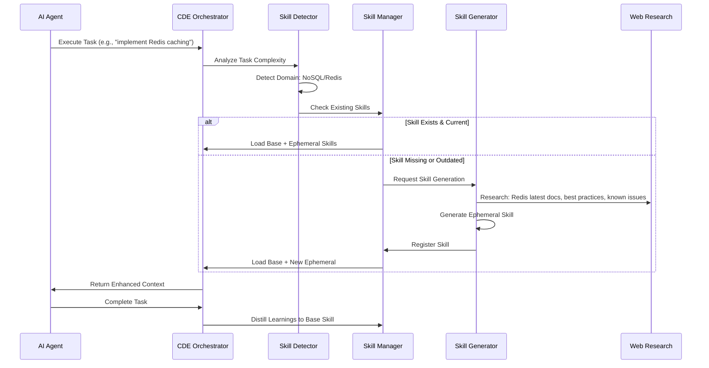

# Dynamic Skill Management System (DSMS)

> **Architecture Type**: Core Pillar - Auto-evolving Knowledge System
> **Creation Date**: 2025-11-01
> **Status**: Design Specification
> **Priority**: 🔴 CRITICAL - Foundation for AI-Driven Evolution

---

## 🎯 Vision Statement

**Every workflow execution becomes an opportunity for the system to learn, adapt, and evolve its capabilities.**

The Dynamic Skill Management System (DSMS) transforms CDE Orchestrator from a static workflow engine into a **self-improving AI assistant** that:
- Detects when tasks require specialized knowledge
- Searches external skill repositories for best practices
- Researches the latest tools, libraries, and patterns from the web
- Generates context-aware, up-to-date skills on demand
- Maintains institutional memory through persistent base skills
- Creates ephemeral task-specific skills for complex operations

---

## 🏗️ Architecture Overview

### Dual-Skill System

```
┌─────────────────────────────────────────────────────────┐
│                    WORKFLOW EXECUTION                    │
│         (Every Task/Phase/Recipe Invocation)            │
└─────────────────────┬───────────────────────────────────┘
                      │
         ┌────────────▼────────────┐
         │  SKILL REQUIREMENT      │
         │  DETECTOR (SRD)         │
         │  - Complexity Analysis  │
         │  - Domain Detection     │
         │  - Knowledge Gap ID     │
         └────────────┬────────────┘
                      │
        ┌─────────────┴─────────────┐
        │                           │
    ┌───▼────┐                 ┌───▼────┐
    │  BASE  │                 │ EPHEME │
    │ SKILL  │◄────────────────┤  RAL   │
    │ (Pers) │  Distill Learn  │ SKILL  │
    └───┬────┘                 └───┬────┘
        │                          │
        │    ┌──────────────┐      │
        └────►  SKILL LOOP  ◄──────┘
             │  ORCHESTRATOR│
             └──────┬───────┘
                    │
    ┌───────────────┼───────────────┐
    │               │               │
┌───▼────┐    ┌────▼─────┐   ┌────▼────┐
│ SKILL  │    │  SKILL   │   │  SKILL  │
│SOURCER │    │GENERATOR │   │ UPDATER │
│(Extern)│    │(AI+Web)  │   │(Research)│
└───┬────┘    └────┬─────┘   └────┬────┘
    │              │              │
    ▼              ▼              ▼
┌─────────────────────────────────────┐
│     .copilot/skills/                │
│     ├── base/                       │
│     │   ├── skill-management.md     │ ← Persistent
│     │   ├── web-research.md         │ ← Grows
│     │   └── code-generation.md      │ ← Updates
│     └── ephemeral/                  │
│         ├── nosql-redis-impl.md     │ ← Task-specific
│         └── react-perf-audit.md     │ ← Cleaned after
└─────────────────────────────────────┘
```

### Component Breakdown

| Component | Purpose | Lifespan | Location |
|-----------|---------|----------|----------|
| **Skill Requirement Detector (SRD)** | Analyzes task complexity, identifies knowledge gaps | Per-invocation | `skill_detector.py` |
| **Skill Sourcer** | Scrapes awesome-claude-skills, GitHub repos | On-demand | `skill_sourcer.py` |
| **Skill Generator** | Creates new skills via AI + web research | On-demand | `skill_generator.py` |
| **Skill Updater** | Keeps skills current with latest docs/versions | Background | `skill_updater.py` |
| **Base Skill** | Generic, accumulative knowledge | Persistent | `.copilot/skills/base/` |
| **Ephemeral Skill** | Task-specific, context-rich | Temporary | `.copilot/skills/ephemeral/` |

---

## 📋 Core Workflows

### Workflow 1: Task Execution with Skill Loop



### Workflow 2: Skill Sourcing from External Repos

```python
# Pseudocode
def source_skill_from_awesome_claude(domain: str) -> Optional[SkillTemplate]:
    """
    Navigates awesome-claude-skills repo to find relevant skill templates.
    """
    repo_url = "https://github.com/travisvn/awesome-claude-skills"

    # 1. Scrape README for domain-related skills
    skills = github_repo_search(repo_url, query=domain)

    # 2. For each matching skill:
    for skill in skills:
        # Download SKILL.md
        template = download_skill_template(skill.url)

        # Extract structure, patterns, tools
        metadata = parse_skill_metadata(template)

        # Adapt to CDE format
        adapted = adapt_to_cde_format(metadata)

        return adapted

    return None
```

### Workflow 3: Web-Driven Skill Update

```python
async def update_skill_with_web_research(skill: Skill) -> UpdatedSkill:
    """
    Keeps skills current by researching latest information.
    """
    # 1. Identify skill's domain and tools
    domain = skill.metadata.domain
    tools = skill.metadata.tools  # e.g., ["redis", "python"]

    # 2. Research latest versions
    latest_versions = await research_tool_versions(tools)

    # 3. Find breaking changes, deprecations
    changes = await search_changelog_and_issues(tools)

    # 4. Extract best practices from docs
    best_practices = await scrape_official_docs(tools)

    # 5. Append update notes (DO NOT touch core logic)
    update_note = f"""
## 📅 Update Log

### {datetime.now().strftime('%Y-%m-%d')}
- **Redis:** Updated to v7.2.4
  - [Breaking] `MIGRATE` command now requires explicit `AUTH`
  - [New] `SINTERCARD` for efficient set cardinality
  - [Best Practice] Use connection pooling with `redis-py>=5.0`
  - [Known Issue] Memory leak in Pub/Sub fixed in 7.2.3+ (GitHub #12345)
  - [Reference] https://redis.io/docs/releases/7.2.4/
"""

    skill.append_update_note(update_note)
    return skill
```

---

## 🔍 Skill Requirement Detector (SRD)

### Detection Heuristics

The SRD analyzes tasks using multiple dimensions:

```python
class SkillRequirementDetector:
    """Detects when a task requires specialized skill knowledge."""

    COMPLEXITY_INDICATORS = {
        "high": [
            r"implement .+ (cache|queue|database)",
            r"optimize .+ performance",
            r"migrate .+ to .+",
            r"integrate .+ with .+",
            r"security audit",
            r"scale .+ to handle .+"
        ],
        "medium": [
            r"refactor .+",
            r"add .+ feature",
            r"fix .+ bug",
            r"improve .+"
        ],
        "low": [
            r"rename .+",
            r"format .+",
            r"update .+ comment"
        ]
    }

    DOMAIN_PATTERNS = {
        "database": [r"(sql|nosql|postgres|mongo|redis|dynamodb)"],
        "web": [r"(react|vue|angular|nextjs|api|rest|graphql)"],
        "infrastructure": [r"(docker|kubernetes|terraform|aws|gcp)"],
        "ml": [r"(machine learning|neural|model|training|inference)"],
        "security": [r"(auth|encryption|oauth|jwt|vulnerability)"]
    }

    def analyze_task(self, task: str) -> SkillRequirement:
        """Determine if task needs specialized skill."""
        complexity = self._detect_complexity(task)
        domain = self._detect_domain(task)
        knowledge_gaps = self._identify_gaps(task, domain)

        return SkillRequirement(
            needs_skill=complexity in ["high", "medium"],
            complexity=complexity,
            domain=domain,
            knowledge_gaps=knowledge_gaps,
            suggested_sources=self._suggest_sources(domain)
        )
```

### Knowledge Gap Identification

```python
def _identify_gaps(self, task: str, domain: str) -> List[str]:
    """
    Identify what knowledge is missing from current skill set.

    Examples:
    - Task: "Implement Redis caching for FastAPI endpoints"
    - Gaps: ["redis connection pooling", "fastapi middleware",
             "cache invalidation strategies", "error handling"]
    """
    # Extract entities (tools, frameworks, patterns)
    entities = self._extract_entities(task)

    # Check existing skills
    existing_knowledge = self._scan_base_skills(domain)

    # Calculate gaps
    gaps = [e for e in entities if e not in existing_knowledge]

    return gaps
```

---

## 🎨 Skill Structure

### Base Skill Format (Persistent)

```markdown
---
skill_type: base
domain: database
tools: [redis, python, asyncio]
version: 2.1.0
last_updated: 2025-11-01
---

# Redis Caching for Python Applications

## Context
This skill provides best practices for implementing Redis as a caching layer
in Python applications, with focus on async patterns and production-ready code.

## Core Patterns

### Connection Management
\`\`\`python
import redis.asyncio as redis

async def get_redis_pool():
    return redis.ConnectionPool(
        host='localhost',
        port=6379,
        db=0,
        decode_responses=True,
        max_connections=50  # Production-ready pool
    )
\`\`\`

### Cache-Aside Pattern
\`\`\`python
async def get_user_cached(user_id: str) -> User:
    cache_key = f"user:{user_id}"

    # Try cache first
    cached = await redis_client.get(cache_key)
    if cached:
        return User.parse_raw(cached)

    # Fetch from DB
    user = await db.get_user(user_id)

    # Update cache
    await redis_client.setex(
        cache_key,
        3600,  # 1 hour TTL
        user.json()
    )

    return user
\`\`\`

## Known Issues & Gotchas

- **Memory Leak in Pub/Sub (< 7.2.3)**: Fixed in Redis 7.2.3+
  - Issue: https://github.com/redis/redis/issues/12345
  - Workaround: Upgrade or use separate client for pub/sub

- **Connection Pool Exhaustion**: Common with blocking operations
  - Solution: Use `redis.asyncio` instead of sync client
  - Monitor: `INFO stats` → `connected_clients`

---

## 📅 Update History

### 2025-11-01 (v2.1.0)
- **Redis 7.2.4 Released**
  - New: `SINTERCARD` command for efficient set operations
  - Breaking: `MIGRATE` now requires explicit `AUTH` parameter
  - Docs: https://redis.io/docs/releases/7.2.4/

- **redis-py 5.0.1**
  - Added: Built-in health checks via `redis.asyncio.Redis.ping()`
  - Fixed: Memory leak in connection pool cleanup
  - Docs: https://redis-py.readthedocs.io/en/stable/

### 2025-09-15 (v2.0.0)
- Initial skill creation
- Coverage: Basic patterns, async support, error handling
```

### Ephemeral Skill Format (Task-Specific)

```markdown
---
skill_type: ephemeral
task_id: TASK-Redis-FastAPI-001
created: 2025-11-01T14:30:00Z
expires: 2025-11-02T14:30:00Z
parent_base_skill: redis-caching
---

# Redis Caching for FastAPI Endpoints (Task-Specific)

## Task Context
**User Request:** "Implement Redis caching for our FastAPI product catalog API
with automatic invalidation when products are updated."

**Specific Requirements:**
- Cache GET /products/{id} responses
- Invalidate cache on PUT/DELETE operations
- Handle cache stampede for popular products
- Monitor cache hit rate via Prometheus metrics

## FastAPI-Specific Implementation

### Middleware Approach
\`\`\`python
from fastapi import FastAPI, Request, Response
from functools import wraps
import hashlib

app = FastAPI()

def cache_response(ttl: int = 300):
    """FastAPI route decorator for Redis caching."""
    def decorator(func):
        @wraps(func)
        async def wrapper(*args, **kwargs):
            request: Request = kwargs.get('request')

            # Generate cache key from route + params
            cache_key = _generate_cache_key(request)

            # Try cache
            cached = await redis_client.get(cache_key)
            if cached:
                return Response(
                    content=cached,
                    media_type="application/json",
                    headers={"X-Cache": "HIT"}
                )

            # Execute endpoint
            response = await func(*args, **kwargs)

            # Cache response
            await redis_client.setex(
                cache_key,
                ttl,
                response.body.decode()
            )

            return response

        return wrapper
    return decorator

@app.get("/products/{product_id}")
@cache_response(ttl=600)  # 10 minutes
async def get_product(product_id: str, request: Request):
    product = await db.get_product(product_id)
    return product
\`\`\`

### Cache Invalidation Strategy
\`\`\`python
@app.put("/products/{product_id}")
async def update_product(product_id: str, data: ProductUpdate):
    # Update database
    await db.update_product(product_id, data)

    # Invalidate cache
    cache_pattern = f"product:{product_id}:*"
    keys = await redis_client.keys(cache_pattern)
    if keys:
        await redis_client.delete(*keys)

    return {"status": "updated", "cache_invalidated": len(keys)}
\`\`\`

### Cache Stampede Prevention (Distributed Lock)
\`\`\`python
from redis.lock import Lock

async def get_product_safe(product_id: str):
    cache_key = f"product:{product_id}"
    lock_key = f"lock:{cache_key}"

    # Try cache
    cached = await redis_client.get(cache_key)
    if cached:
        return cached

    # Acquire lock to prevent stampede
    async with Lock(redis_client, lock_key, timeout=5):
        # Double-check cache (might have been populated)
        cached = await redis_client.get(cache_key)
        if cached:
            return cached

        # Fetch from DB (only one request does this)
        product = await db.get_product(product_id)
        await redis_client.setex(cache_key, 600, product)
        return product
\`\`\`

## Monitoring (Prometheus)

\`\`\`python
from prometheus_client import Counter, Histogram

cache_hits = Counter('redis_cache_hits_total', 'Total cache hits')
cache_misses = Counter('redis_cache_misses_total', 'Total cache misses')
cache_errors = Counter('redis_cache_errors_total', 'Total cache errors')

# Add to wrapper function:
if cached:
    cache_hits.inc()
else:
    cache_misses.inc()
\`\`\`

## Task-Specific Gotchas

1. **FastAPI Request Objects are not serializable**
   - ❌ Don't cache `Request` directly
   - ✅ Extract params, headers, body for key generation

2. **Lifespan Events for Redis Connection**
   \`\`\`python
   @app.on_event("startup")
   async def startup():
       app.state.redis = await redis.from_url("redis://localhost")

   @app.on_event("shutdown")
   async def shutdown():
       await app.state.redis.close()
   \`\`\`

3. **Pattern-based key deletion is slow**
   - Use `SCAN` instead of `KEYS` in production
   - Consider key namespacing: `product:{id}:v1`

## References
- FastAPI Middleware: https://fastapi.tiangolo.com/tutorial/middleware/
- Redis Distributed Locks: https://redis.io/docs/manual/patterns/distributed-locks/
- Cache Stampede Pattern: https://en.wikipedia.org/wiki/Cache_stampede

---

**Note:** This ephemeral skill will be archived after task completion.
Key learnings will be distilled into the base "redis-caching" skill.
```

---

## 🔄 Skill Lifecycle Management

### Generation Flow

```python
class SkillGenerator:
    """Generates skills on-demand with web research."""

    async def generate_skill(
        self,
        task: str,
        domain: str,
        knowledge_gaps: List[str]
    ) -> EphemeralSkill:
        """
        Creates a new skill by combining:
        1. External skill templates (awesome-claude-skills)
        2. Web research (latest docs, Stack Overflow, GitHub issues)
        3. Base skill knowledge
        """
        # Step 1: Source external templates
        templates = await self.skill_sourcer.search_templates(domain)

        # Step 2: Research each knowledge gap
        research_results = []
        for gap in knowledge_gaps:
            results = await self.web_researcher.research(
                query=f"{gap} best practices latest 2025",
                sources=["official_docs", "github", "stackoverflow"]
            )
            research_results.append(results)

        # Step 3: Extract known issues
        known_issues = await self.issue_tracker.search_issues(
            domain=domain,
            tools=knowledge_gaps
        )

        # Step 4: Generate skill via LLM
        prompt = self._build_generation_prompt(
            task=task,
            templates=templates,
            research=research_results,
            issues=known_issues
        )

        skill_content = await self.llm.generate(prompt)

        # Step 5: Create ephemeral skill file
        skill = EphemeralSkill(
            content=skill_content,
            task_id=uuid.uuid4(),
            domain=domain,
            created_at=datetime.now(),
            expires_at=datetime.now() + timedelta(hours=24)
        )

        await self.skill_store.save(skill, location="ephemeral")

        return skill
```

### Update Flow (Background Job)

```python
class SkillUpdater:
    """Keeps base skills current with periodic web research."""

    async def update_outdated_skills(self):
        """
        Runs daily to check for skill updates.
        """
        base_skills = self.skill_store.list_skills(type="base")

        for skill in base_skills:
            if self._needs_update(skill):
                updated = await self._research_and_update(skill)
                await self.skill_store.save(updated, location="base")
                logger.info(f"Updated skill: {skill.name} v{updated.version}")

    def _needs_update(self, skill: BaseSkill) -> bool:
        """Check if skill is outdated (> 30 days old)."""
        age = (datetime.now() - skill.last_updated).days
        return age > 30

    async def _research_and_update(self, skill: BaseSkill) -> BaseSkill:
        """
        Research latest changes for skill's tools and append update notes.
        """
        tools = skill.metadata.tools

        # Research each tool
        updates = []
        for tool in tools:
            changelog = await self.web_researcher.fetch_changelog(tool)
            latest_version = changelog.latest_version
            breaking_changes = changelog.breaking_changes
            new_features = changelog.new_features

            # Search for known issues
            issues = await self.github_searcher.search_issues(
                repo=tool,
                labels=["bug", "breaking-change"],
                since=skill.last_updated
            )

            updates.append({
                "tool": tool,
                "version": latest_version,
                "changes": breaking_changes + new_features,
                "issues": issues
            })

        # Generate update note
        update_note = self._format_update_note(updates)

        # Append to skill (DO NOT modify core content)
        skill.append_update_note(update_note)
        skill.version = self._bump_version(skill.version)
        skill.last_updated = datetime.now()

        return skill
```

### Distillation Flow (Post-Task)

```python
async def distill_ephemeral_to_base(ephemeral: EphemeralSkill):
    """
    After task completion, extract reusable patterns and add to base skill.
    """
    # 1. Extract code patterns from ephemeral skill
    patterns = extract_code_patterns(ephemeral.content)

    # 2. Identify generic (non-task-specific) knowledge
    generic_knowledge = filter_generic_patterns(patterns)

    # 3. Find corresponding base skill
    base_skill = skill_store.get_base_skill(ephemeral.domain)

    # 4. Check if patterns already exist in base
    new_patterns = [p for p in generic_knowledge if p not in base_skill]

    if new_patterns:
        # 5. Append to base skill under "Community Patterns" section
        base_skill.append_section(
            title="Community Patterns",
            content=format_patterns(new_patterns),
            source=f"Distilled from task {ephemeral.task_id}"
        )

        await skill_store.save(base_skill, location="base")
        logger.info(f"Distilled {len(new_patterns)} patterns to {base_skill.name}")
```

---

## 🌐 Web Research Components

### Skill Sourcer

```python
class SkillSourcer:
    """Navigates external repositories to extract skill templates."""

    SOURCES = [
        "https://github.com/travisvn/awesome-claude-skills",
        "https://github.com/anthropics/skills",
        "https://github.com/obra/superpowers-skills"
    ]

    async def search_templates(self, domain: str) -> List[SkillTemplate]:
        """
        Search across all skill repositories for domain-related templates.
        """
        templates = []

        for repo_url in self.SOURCES:
            # Scrape README for relevant skills
            readme = await self.fetch_readme(repo_url)
            skill_links = self.parse_skill_links(readme, domain)

            for link in skill_links:
                # Download SKILL.md file
                skill_content = await self.download_skill(link)

                # Parse metadata
                template = self.parse_skill_template(skill_content)
                templates.append(template)

        return templates

    def parse_skill_template(self, content: str) -> SkillTemplate:
        """
        Extract structure, patterns, and best practices from skill file.
        """
        # Parse YAML frontmatter
        metadata = self._parse_frontmatter(content)

        # Extract code blocks
        code_examples = self._extract_code_blocks(content)

        # Extract patterns (## Pattern sections)
        patterns = self._extract_patterns(content)

        # Extract gotchas/issues
        known_issues = self._extract_known_issues(content)

        return SkillTemplate(
            name=metadata.get("name"),
            domain=metadata.get("domain"),
            tools=metadata.get("tools", []),
            code_examples=code_examples,
            patterns=patterns,
            known_issues=known_issues,
            source_url=metadata.get("source")
        )
```

### Web Researcher

```python
class WebResearcher:
    """Performs targeted web research for skill generation/updates."""

    async def research(
        self,
        query: str,
        sources: List[str] = ["official_docs", "github", "stackoverflow"]
    ) -> ResearchResults:
        """
        Multi-source research with latest information bias.
        """
        results = ResearchResults()

        if "official_docs" in sources:
            results.docs = await self._search_official_docs(query)

        if "github" in sources:
            results.issues = await self._search_github_issues(query)
            results.discussions = await self._search_discussions(query)

        if "stackoverflow" in sources:
            results.qa = await self._search_stackoverflow(query)

        # Filter by recency (prioritize 2024-2025 content)
        results.filter_by_date(since="2024-01-01")

        return results

    async def _search_official_docs(self, query: str) -> List[DocSnippet]:
        """
        Use Gemini CLI or web scraping to fetch official documentation.
        """
        # Extract tool name from query (e.g., "redis best practices" → "redis")
        tool = self._extract_tool_name(query)

        # Known doc sites
        doc_urls = {
            "redis": "https://redis.io/docs/",
            "fastapi": "https://fastapi.tiangolo.com/",
            "postgres": "https://www.postgresql.org/docs/"
        }

        if tool in doc_urls:
            # Scrape documentation
            docs = await self.scraper.fetch_page(doc_urls[tool])
            relevant = self.extract_relevant_sections(docs, query)
            return relevant

        # Fallback: Gemini search
        return await self.gemini_search(f"{query} site:{tool}.io OR site:{tool}.com")

    async def _search_github_issues(self, query: str) -> List[Issue]:
        """
        Search GitHub for known issues, bugs, workarounds.
        """
        tool = self._extract_tool_name(query)

        # Search across popular repos
        issues = await self.github.search_issues(
            query=f"{query} is:issue",
            sort="updated",
            order="desc",
            per_page=10
        )

        return [
            Issue(
                title=issue.title,
                url=issue.html_url,
                state=issue.state,
                created_at=issue.created_at,
                body=issue.body[:500]  # Truncate
            )
            for issue in issues
        ]
```

---

## 🔧 Implementation Plan

### Phase 1: Foundation (Week 1-2)

**Files to Create:**
```
src/cde_orchestrator/skills/
├── __init__.py
├── detector.py          # SkillRequirementDetector
├── manager.py           # SkillManager (orchestrator)
├── sourcer.py           # SkillSourcer
├── generator.py         # SkillGenerator
├── updater.py           # SkillUpdater
├── researcher.py        # WebResearcher
└── models.py            # SkillRequirement, BaseSkill, EphemeralSkill
```

**Tasks:**
- [ ] **TASK-01**: Implement `SkillRequirementDetector` with complexity/domain heuristics
- [ ] **TASK-02**: Create `SkillManager` to orchestrate skill lifecycle
- [ ] **TASK-03**: Build `SkillSourcer` to scrape awesome-claude-skills repo
- [ ] **TASK-04**: Implement `WebResearcher` with Gemini CLI integration

**Acceptance Criteria:**
```python
# Test case
def test_skill_detection():
    detector = SkillRequirementDetector()

    task = "Implement Redis caching for FastAPI with pub/sub"
    requirement = detector.analyze_task(task)

    assert requirement.needs_skill == True
    assert requirement.complexity == "high"
    assert requirement.domain == "database"
    assert "redis" in requirement.knowledge_gaps
```

### Phase 2: Skill Generation (Week 3-4)

**Tasks:**
- [ ] **TASK-05**: Implement `SkillGenerator` with LLM-powered generation
- [ ] **TASK-06**: Create skill templates for top 5 domains (database, web, infra, ml, security)
- [ ] **TASK-07**: Build ephemeral skill cleanup job (delete after 24h)
- [ ] **TASK-08**: Add distillation logic (ephemeral → base)

**Acceptance Criteria:**
```python
async def test_skill_generation():
    generator = SkillGenerator()

    skill = await generator.generate_skill(
        task="Implement Redis pub/sub for real-time notifications",
        domain="database",
        knowledge_gaps=["redis pub/sub", "fastapi websockets"]
    )

    assert skill.content is not None
    assert "redis.asyncio.PubSub" in skill.content
    assert "Known Issues" in skill.content
    assert skill.expires_at > datetime.now()
```

### Phase 3: Skill Updates (Week 5-6)

**Tasks:**
- [ ] **TASK-09**: Implement `SkillUpdater` with background job
- [ ] **TASK-10**: Add version detection for tools (scrape package registries)
- [ ] **TASK-11**: Create update note formatter (markdown template)
- [ ] **TASK-12**: Add skill version history tracking

**Acceptance Criteria:**
```python
async def test_skill_update():
    updater = SkillUpdater()

    old_skill = BaseSkill(
        name="redis-caching",
        version="1.0.0",
        last_updated=datetime(2025, 1, 1),
        tools=["redis", "redis-py"]
    )

    updated = await updater.update_skill(old_skill)

    assert updated.version == "1.1.0"
    assert updated.last_updated > old_skill.last_updated
    assert "Update History" in updated.content
    assert any("redis-py 5.0" in note for note in updated.update_notes)
```

### Phase 4: Integration with CDE Workflow (Week 7-8)

**Tasks:**
- [ ] **TASK-13**: Hook SRD into `cde_startFeature` and `cde_submitWork`
- [ ] **TASK-14**: Add MCP tools: `cde_listSkills`, `cde_getSkill`, `cde_updateSkill`
- [ ] **TASK-15**: Create skill UI in `.copilot/skills/` directory
- [ ] **TASK-16**: Add monitoring: skill usage stats, generation time, hit rate

**New MCP Tools:**
```python
@app.tool()
def cde_listSkills(skill_type: Optional[str] = None) -> str:
    """
    List all available skills.

    Args:
        skill_type: Filter by 'base' or 'ephemeral'

    Returns:
        JSON: {"skills": [{"name": "...", "domain": "...", "version": "..."}]}
    """
    pass

@app.tool()
def cde_getSkill(skill_name: str) -> str:
    """
    Retrieve full content of a skill.

    Returns:
        Markdown content of the skill
    """
    pass

@app.tool()
def cde_refreshSkills() -> str:
    """
    Trigger immediate skill update check (instead of waiting for background job).

    Returns:
        JSON: {"updated": 3, "skipped": 5, "errors": 0}
    """
    pass
```

---

## 📊 Monitoring & Observability

### Metrics to Track

```python
class SkillMetrics:
    """Prometheus-style metrics for DSMS."""

    skill_generations = Counter(
        'dsms_skill_generations_total',
        'Total skills generated',
        ['domain', 'complexity']
    )

    skill_updates = Counter(
        'dsms_skill_updates_total',
        'Total skill updates',
        ['skill_name']
    )

    skill_hits = Counter(
        'dsms_skill_hits_total',
        'Skills loaded during task execution',
        ['skill_name', 'type']
    )

    generation_duration = Histogram(
        'dsms_skill_generation_duration_seconds',
        'Time to generate skill',
        buckets=[1, 5, 10, 30, 60, 120]
    )

    research_api_calls = Counter(
        'dsms_research_api_calls_total',
        'External API calls for research',
        ['provider']  # gemini, github, stackoverflow
    )
```

### Dashboard Queries

```promql
# Skill generation rate (per hour)
rate(dsms_skill_generations_total[1h])

# Most frequently used skills
topk(10, sum by (skill_name) (dsms_skill_hits_total))

# Average skill generation time
histogram_quantile(0.95, dsms_skill_generation_duration_seconds)

# Skill update freshness
time() - dsms_skill_last_updated_timestamp
```

---

## 🎯 Success Criteria

### Quantitative Metrics

| Metric | Target | Measurement |
|--------|--------|-------------|
| Skill Generation Success Rate | > 90% | Generations without errors / Total attempts |
| Average Generation Time | < 30s | P95 of generation_duration histogram |
| Skill Hit Rate | > 60% | Tasks using skills / Total tasks |
| Update Freshness | < 30 days | Average age of base skills |
| Research Accuracy | > 85% | Manual review of 20 generated skills |

### Qualitative Metrics

- [ ] Skills contain actionable, copy-paste-ready code examples
- [ ] Update notes include clear references (links to docs/issues)
- [ ] No redundant information between base and ephemeral skills
- [ ] Skills are self-contained (minimal cross-references)
- [ ] Known issues section includes workarounds

---

## 🚧 Challenges & Mitigations

### Challenge 1: LLM Hallucinations in Generated Skills

**Risk:** Generated skills may contain outdated or incorrect information.

**Mitigation:**
- Always include source URLs in skills
- Implement citation verification (check if links are 404)
- Add validation step: LLM reviews own output for contradictions
- Human-in-the-loop for critical domains (security, infrastructure)

### Challenge 2: External API Rate Limits

**Risk:** GitHub/StackOverflow/Gemini rate limits during research.

**Mitigation:**
- Implement exponential backoff with retries
- Cache research results for 7 days (SQLite)
- Prioritize official docs over community sources
- Rotate API keys if available

### Challenge 3: Skill Bloat

**Risk:** Base skills grow too large, consuming excessive tokens.

**Mitigation:**
- Set max skill size: 5000 tokens (track with tiktoken)
- Archive old update notes after 90 days
- Split large skills into sub-skills (e.g., `redis-caching` → `redis-caching-basics`, `redis-caching-advanced`)
- Implement skill compression: summarize redundant sections

### Challenge 4: Context Window Overflow

**Risk:** Loading base + ephemeral skills exceeds LLM context window.

**Mitigation:**
- Load skills lazily (only when SRD detects need)
- Implement skill ranking: load most relevant skills first
- Use skill summaries (100-token version) for initial context
- Fallback: truncate ephemeral skill if base skill is critical

---

## 🔮 Future Enhancements

### Multi-Agent Skill Collaboration

Allow multiple agents to contribute to skill evolution:

```yaml
# .copilot/skills/base/redis-caching.md
contributors:
  - agent: copilot-001
    date: 2025-11-01
    contribution: "Added cache stampede prevention pattern"
  - agent: gemini-002
    date: 2025-11-05
    contribution: "Updated to Redis 7.2.4 with SINTERCARD example"
  - agent: qwen-003
    date: 2025-11-10
    contribution: "Added Prometheus monitoring setup"
```

### Skill Marketplace

Share skills across CDE installations:

```bash
# Publish skill to marketplace
cde skill publish redis-caching --public

# Install community skill
cde skill install community/postgres-pooling
```

### Automatic Skill Testing

Generate test suites for skills:

```python
# Auto-generated test from skill code examples
@pytest.mark.asyncio
async def test_redis_cache_aside_pattern():
    """Test generated from redis-caching skill."""
    user = await get_user_cached("user123")
    assert user.id == "user123"

    # Verify cache was populated
    cached = await redis_client.get("user:user123")
    assert cached is not None
```

---

## 📚 References

### External Skill Repositories
- [awesome-claude-skills](https://github.com/travisvn/awesome-claude-skills) - 1.5k⭐ curated skill list
- [anthropics/skills](https://github.com/anthropics/skills) - Official Anthropic skills
- [obra/superpowers](https://github.com/obra/superpowers) - 20+ battle-tested skills

### Documentation
- [Claude Skills Documentation](https://docs.claude.com/en/api/skills)
- [POML Specification](https://github.com/promptfoo/promptfoo/blob/main/POML.md)
- [Skill Creation Best Practices](https://www.anthropic.com/engineering/equipping-agents-for-the-real-world-with-agent-skills)

### Related Research
- [RAG for Code Generation](https://arxiv.org/abs/2401.00850) - Context retrieval patterns
- [Self-Improving Agents](https://arxiv.org/abs/2305.09788) - Learning from execution
- [Tool Use in LLMs](https://arxiv.org/abs/2310.06628) - Dynamic capability extension

---

## 🎬 Conclusion

The Dynamic Skill Management System transforms CDE Orchestrator into a **living, learning system** that:

1. **Never becomes obsolete** - Continuous web research keeps skills current
2. **Learns from every task** - Ephemeral skills distill into institutional memory
3. **Scales infinitely** - External skill repositories provide endless knowledge
4. **Self-improves** - Each execution refines the system's capabilities

**Next Steps:**
1. Review this design with stakeholders
2. Approve Phase 1 implementation (Foundation)
3. Create feature branch: `feature/dynamic-skill-system`
4. Begin TASK-01: SkillRequirementDetector

---

**Document Status:** ✅ Ready for Implementation
**Estimated Effort:** 8 weeks (2 weeks × 4 phases)
**Dependencies:** Gemini CLI, GitHub API, Web scraping library (BeautifulSoup/Playwright)
**Risk Level:** Medium (external API dependencies, LLM hallucination risk)
