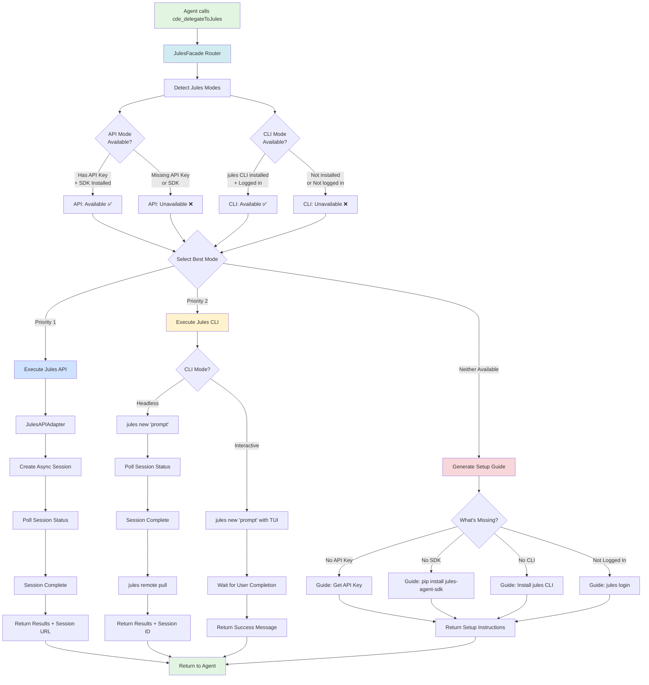

# Jules Dual-Mode Execution Flow

## Complete Flow Diagram



## Decision Tree (Detailed)

```text
cde_delegateToJules(prompt, mode="auto")
│
├─ mode == "auto" (Intelligent Selection)
│   │
│   ├─ Detect API Mode
│   │   ├─ Check: JULES_API_KEY in env?
│   │   ├─ Check: jules-agent-sdk installed?
│   │   └─ Result: API Available = (Key ✅ AND SDK ✅)
│   │
│   ├─ Detect CLI Mode
│   │   ├─ Check: `which jules` exists?
│   │   ├─ Check: `jules remote list` succeeds?
│   │   └─ Result: CLI Available = (Installed ✅ AND Logged In ✅)
│   │
│   └─ Priority Selection:
│       ├─ If API Available → Use API (Best: Async, Full Context)
│       ├─ Elif CLI Available → Use CLI (Fallback: Local, Fast)
│       └─ Else → Generate Setup Guide (Neither Available)
│
├─ mode == "api" (Force API)
│   ├─ If API Available → Use API
│   └─ Else → Error: "API mode requested but not available. Setup required."
│
├─ mode == "cli" (Force CLI Headless)
│   ├─ If CLI Available → Use CLI (Headless)
│   └─ Else → Error: "CLI mode requested but not available. Run: jules login"
│
└─ mode == "interactive" (Force CLI Interactive)
    ├─ If CLI Available → Launch TUI (jules new with interactive mode)
    └─ Else → Error: "CLI not available. Install from: https://jules.google/cli"
```

## Execution Paths

### Path 1: API Mode (Optimal)

```text
┌──────────────────────────────────────────────────────────────┐
│ INPUT                                                        │
│ - user_prompt: "Add user authentication"                    │
│ - mode: "auto"                                               │
│ - API Key: ✅ Present in .env                                │
│ - SDK: ✅ jules-agent-sdk installed                          │
└──────────────────────────────────────────────────────────────┘
                        ↓
┌──────────────────────────────────────────────────────────────┐
│ DETECTION                                                    │
│ detect_jules_modes() returns:                               │
│   {                                                           │
│     "api": {"available": true, "has_api_key": true},        │
│     "cli": {"available": false},                            │
│     "preferred_mode": "api"                                  │
│   }                                                           │
└──────────────────────────────────────────────────────────────┘
                        ↓
┌──────────────────────────────────────────────────────────────┐
│ EXECUTION (JulesAPIAdapter)                                  │
│                                                               │
│ 1. Create AsyncJulesClient with API key                     │
│ 2. Start async session:                                      │
│    - Repo: Current project                                   │
│    - Prompt: "Add user authentication"                       │
│    - Context: Full repository (100k+ lines)                  │
│ 3. Poll session every 30 seconds                             │
│ 4. Wait for status == "COMPLETED"                            │
│ 5. Retrieve modified files                                   │
└──────────────────────────────────────────────────────────────┘
                        ↓
┌──────────────────────────────────────────────────────────────┐
│ OUTPUT (JSON)                                                │
│ {                                                             │
│   "success": true,                                           │
│   "mode": "api",                                             │
│   "session_id": "abc123",                                    │
│   "session_url": "https://jules.google/sessions/abc123",    │
│   "modified_files": ["src/auth.py", "tests/test_auth.py"],  │
│   "message": "✅ Task completed via Jules API",              │
│   "execution_time": "4m 32s"                                 │
│ }                                                             │
└──────────────────────────────────────────────────────────────┘
```

### Path 2: CLI Fallback (API Unavailable)

```text
┌──────────────────────────────────────────────────────────────┐
│ INPUT                                                        │
│ - user_prompt: "Fix typo in README"                         │
│ - mode: "auto"                                               │
│ - API Key: ❌ Not set                                         │
│ - CLI: ✅ Installed + Logged in                              │
└──────────────────────────────────────────────────────────────┘
                        ↓
┌──────────────────────────────────────────────────────────────┐
│ DETECTION                                                    │
│ detect_jules_modes() returns:                               │
│   {                                                           │
│     "api": {"available": false, "has_api_key": false},      │
│     "cli": {"available": true, "logged_in": true},          │
│     "preferred_mode": "cli"                                  │
│   }                                                           │
└──────────────────────────────────────────────────────────────┘
                        ↓
┌──────────────────────────────────────────────────────────────┐
│ EXECUTION (JulesCLIAdapter - Headless)                       │
│                                                               │
│ 1. cd /project/path                                          │
│ 2. Run: jules new "Fix typo in README"                      │
│    Output: "Session created: 789012"                         │
│ 3. Poll session status every 10 seconds:                     │
│    jules remote list --session 789012                        │
│ 4. When status == "COMPLETED":                               │
│    jules remote pull --session 789012 --apply               │
│ 5. Parse modified files from git diff                        │
└──────────────────────────────────────────────────────────────┘
                        ↓
┌──────────────────────────────────────────────────────────────┐
│ OUTPUT (JSON with Fallback Notice)                          │
│ {                                                             │
│   "success": true,                                           │
│   "mode": "cli_headless",                                    │
│   "session_id": "789012",                                    │
│   "modified_files": ["README.md"],                           │
│   "message": "⚡ Task completed via Jules CLI (API unavailable)", │
│   "upgrade_tip": "For better experience, set up API: https://jules.google/", │
│   "execution_time": "1m 12s"                                 │
│ }                                                             │
└──────────────────────────────────────────────────────────────┘
```

### Path 3: Setup Guide (Nothing Available)

```text
┌──────────────────────────────────────────────────────────────┐
│ INPUT                                                        │
│ - user_prompt: "Add authentication"                         │
│ - mode: "auto"                                               │
│ - API Key: ❌ Not set                                         │
│ - SDK: ❌ Not installed                                       │
│ - CLI: ❌ Not installed                                       │
└──────────────────────────────────────────────────────────────┘
                        ↓
┌──────────────────────────────────────────────────────────────┐
│ DETECTION                                                    │
│ detect_jules_modes() returns:                               │
│   {                                                           │
│     "api": {"available": false},                            │
│     "cli": {"available": false, "installed": false},        │
│     "preferred_mode": "setup"                                │
│   }                                                           │
└──────────────────────────────────────────────────────────────┘
                        ↓
┌──────────────────────────────────────────────────────────────┐
│ GENERATE SETUP GUIDE                                         │
│                                                               │
│ Analyze what's missing:                                      │
│ - API: Missing API key + SDK                                 │
│ - CLI: Not installed                                         │
│                                                               │
│ Generate two setup options:                                  │
│ 1. API Mode (Recommended for complex tasks)                 │
│    Steps: Install SDK → Get API key → Add to .env           │
│ 2. CLI Mode (Easier - No API key needed)                    │
│    Steps: Install CLI → Login with Google                    │
│                                                               │
│ Recommendation: CLI (easier setup)                           │
└──────────────────────────────────────────────────────────────┘
                        ↓
┌──────────────────────────────────────────────────────────────┐
│ OUTPUT (Setup Instructions)                                  │
│ {                                                             │
│   "status": "setup_required",                                │
│   "message": "Jules not configured. Choose setup option:",   │
│   "options": [                                               │
│     {                                                         │
│       "mode": "cli",                                         │
│       "title": "⚡ Quick Start (Recommended)",               │
│       "setup_steps": [                                       │
│         {"step": 1, "command": "brew install jules"},       │
│         {"step": 2, "command": "jules login"}               │
│       ]                                                       │
│     },                                                        │
│     {                                                         │
│       "mode": "api",                                         │
│       "title": "🚀 Full Features",                           │
│       "setup_steps": [                                       │
│         {"step": 1, "command": "pip install jules-agent-sdk"},│
│         {"step": 2, "url": "https://jules.google/"},        │
│         {"step": 3, "file": ".env", "content": "JULES_API_KEY=..."}│
│       ]                                                       │
│     }                                                         │
│   ]                                                           │
│ }                                                             │
└──────────────────────────────────────────────────────────────┘
```

## State Transitions

```text
┌─────────────────┐
│   UNINITIALIZED │  (No detection done yet)
└─────────────────┘
         │
         ↓ [detect_jules_modes()]
         │
    ┌────┴────┐
    ↓         ↓
┌──────┐  ┌──────┐
│ API  │  │ CLI  │
│ Mode │  │ Mode │
└──────┘  └──────┘
    │         │
    │         │
    └────┬────┘
         │
         ↓ [select_mode()]
         │
    ┌────┴────┬───────┬──────────┐
    ↓         ↓       ↓          ↓
┌────────┐ ┌─────┐ ┌─────┐  ┌───────┐
│API Mode│ │CLI  │ │CLI  │  │SETUP  │
│ Async  │ │Head-│ │Inter│  │GUIDE  │
│        │ │less │ │activ│  │       │
└────────┘ └─────┘ └─────┘  └───────┘
    │         │       │          │
    │         │       │          │ [User completes setup]
    │         │       │          └──────────────┐
    │         │       │                         │
    └─────────┴───────┴─────────────────────────┘
                      │
                      ↓
                ┌──────────┐
                │ EXECUTING│
                └──────────┘
                      │
                      ↓
                ┌──────────┐
                │COMPLETED │
                └──────────┘
```

## Error Handling Flow

```text
Try Execute
    │
    ├─ API Mode Selected
    │   ├─ API Key Invalid
    │   │   └─→ Error: "Invalid API key. Get new key: https://jules.google/"
    │   ├─ SDK Missing
    │   │   └─→ Error: "SDK not installed. Run: pip install jules-agent-sdk"
    │   ├─ Network Error
    │   │   └─→ Fallback to CLI if available
    │   │       └─→ Else: Error with retry suggestion
    │   └─ Timeout
    │       └─→ Return session ID for manual monitoring
    │
    ├─ CLI Mode Selected
    │   ├─ Not Logged In
    │   │   └─→ Error: "Not logged in. Run: jules login"
    │   ├─ Session Creation Failed
    │   │   └─→ Error with command output + suggestion
    │   ├─ Execution Timeout
    │   │   └─→ Return session ID for manual check
    │   └─ Permission Denied
    │       └─→ Error: "Git repo not writable. Check permissions."
    │
    └─ Setup Mode
        └─→ Return setup guide (not an error)
```

## Configuration Matrix

| Scenario                          | API Available | CLI Available | Selected Mode | User Experience                     |
|-----------------------------------|---------------|---------------|---------------|-------------------------------------|
| ✅ API key + SDK                  | ✅            | ✅            | API           | Best (async, monitoring)            |
| ✅ API key + SDK                  | ✅            | ❌            | API           | Best (async, monitoring)            |
| ❌ No API, ✅ CLI logged in       | ❌            | ✅            | CLI           | Good (local, fast feedback)         |
| ❌ No API, ❌ CLI not logged in   | ❌            | Partial       | Setup Guide   | Need `jules login`                  |
| ❌ No API, ❌ CLI not installed   | ❌            | ❌            | Setup Guide   | Choose: API setup OR CLI install    |

---

**Visual Summary**: This flow ensures users **never hit a dead end**. Every path leads to either execution or clear setup instructions.
