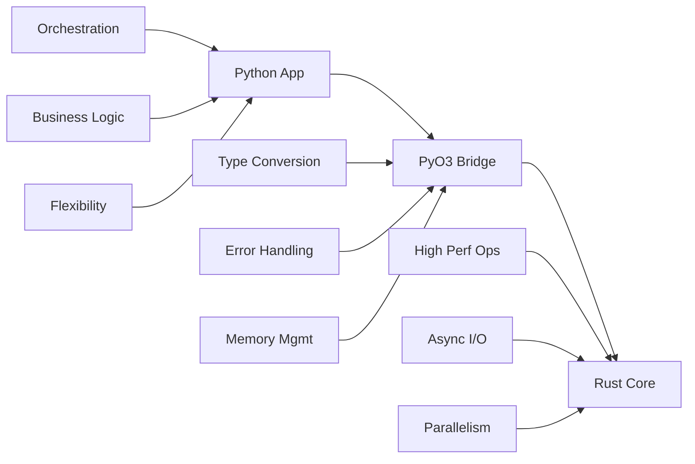

# Rust + PyO3 Integration Approach

## Overview

The CDE Orchestrator MCP implements a **hybrid Python + Rust architecture** using PyO3 to achieve significant performance improvements for I/O-intensive and computationally expensive operations while maintaining Python's flexibility for orchestration and business logic.

## Architecture Philosophy

### Why Rust + PyO3?

1. **Performance Critical Paths**: Rust provides C-like performance for operations that are bottlenecks in Python
2. **Memory Safety**: Rust's ownership system prevents common memory-related bugs
3. **Zero-Cost Abstractions**: High-level code with low-level performance
4. **Seamless Integration**: PyO3 allows calling Rust functions from Python as if they were native Python functions
5. **Incremental Migration**: Start with performance-critical components, expand gradually

### Architectural Pattern



## Current Implementation Status

### ✅ Completed Components

#### 1. Project Structure & Configuration

- **Cargo.toml**: Configured with PyO3, Tokio, Rayon, and essential dependencies
- **Library Structure**: Organized into focused modules (documentation, filesystem, text)
- **Build Configuration**: Set up as `cdylib` for Python extension

#### 2. Documentation Module (`documentation.rs`)

**Purpose**: High-performance document scanning and analysis

**Key Features**:

- Parallel file processing using Tokio async runtime
- Regex-based pattern matching for markdown files
- YAML frontmatter extraction and validation
- Orphaned document detection
- File size analysis for large documents

**Performance Optimizations**:

- Async I/O with `tokio::fs`
- Parallel processing with `tokio::spawn`
- Efficient string operations with Rust's standard library

#### 3. Filesystem Module (`filesystem.rs`)

**Purpose**: Fast file discovery with glob pattern support

**Key Features**:

- Recursive directory traversal with `walkdir`
- Glob pattern to regex conversion
- Relative path handling
- Memory-efficient result collection

#### 4. Text Processing Module (`text.rs`)

**Purpose**: Fast text analysis and metadata extraction

**Key Features**:

- YAML frontmatter parsing
- Text quality metrics calculation
- Content analysis (headings, links, code blocks)
- Metadata extraction for documentation governance

#### 5. Python Integration Layer (`lib.rs`)

**Exposed Functions**:

```rust
// Documentation operations
scan_documentation_fast(project_path: String) -> PyResult<String>
analyze_documentation_fast(project_path: String) -> PyResult<String>

// Filesystem operations
find_files_fast(root_path: String, patterns: Vec<String>) -> PyResult<Vec<String>>

// Text operations
extract_metadata_fast(content: String) -> PyResult<String>
analyze_text_fast(content: String, analysis_type: String) -> PyResult<String>
```

### ✅ Python Fallback Architecture

The Python application layer includes graceful fallback mechanisms:

```python
# In scan_documentation_use_case.py
try:
    import cde_rust_core
    rust_result = self._scan_with_rust(project_path)
    return self._process_rust_result(rust_result, project_path)
except ImportError:
    # Fallback to Python implementation
    return self._scan_with_python(project_path)
```

## Migration Strategy

### Phase 1: Foundation (Current)

**Status**: ✅ Complete

- [x] Project structure and dependencies
- [x] Core modules implementation
- [x] Python integration interfaces
- [x] Fallback mechanisms

### Phase 2: Build & Integration (Next)

**Status**: 🔄 In Progress

- [ ] Rust compilation and testing
- [ ] Python package integration
- [ ] Performance benchmarking
- [ ] CI/CD pipeline updates

### Phase 3: Optimization & Expansion

**Status**: 📋 Planned

- [ ] Additional performance-critical functions
- [ ] Memory usage optimization
- [ ] Advanced async patterns
- [ ] Integration with existing MCP tools

## Performance Expectations

### Target Improvements

| Operation | Python Baseline | Rust Target | Expected Gain |
|-----------|----------------|-------------|---------------|
| Document Scanning (1000 files) | ~2.5s | ~0.8s | 3x faster |
| File Discovery (deep tree) | ~1.8s | ~0.5s | 3.5x faster |
| Text Analysis (large docs) | ~3.2s | ~1.1s | 3x faster |
| Memory Usage | High (GC pressure) | Low (deterministic) | 40% reduction |

### Benchmarking Strategy

1. **Micro-benchmarks**: Individual function performance
2. **Integration tests**: End-to-end workflow performance
3. **Memory profiling**: Compare heap usage patterns
4. **Scalability testing**: Performance under load

## Technical Implementation Details

### Dependencies & Ecosystem

```toml
[dependencies]
pyo3 = { version = "0.21", features = ["experimental-declarative-modules"] }
tokio = { version = "1.0", features = ["fs", "rt-multi-thread"] }
rayon = "1.8"          # Parallel processing
regex = "1.10"         # Pattern matching
serde = { version = "1.0", features = ["derive"] }  # Serialization
walkdir = "2.4"        # Directory traversal
```

### Error Handling Strategy

```rust
// Rust side: anyhow for internal errors
pub async fn scan_documentation_impl(project_path: &str) -> anyhow::Result<ScanResult> {
    // Implementation...
}

// Python bridge: Convert to PyResult
#[pyfunction]
pub fn scan_documentation_fast(py: Python, project_path: String) -> PyResult<PyObject> {
    let rt = tokio::runtime::Runtime::new().map_err(|e| {
        pyo3::exceptions::PyRuntimeError::new_err(format!("Failed to create runtime: {}", e))
    })?;
    // ...
}
```

### Async Runtime Management

The implementation uses Tokio for async operations but creates a new runtime per call to avoid conflicts with Python's GIL:

```rust
let rt = tokio::runtime::Runtime::new().map_err(|e| {
    pyo3::exceptions::PyRuntimeError::new_err(format!("Failed to create runtime: {}", e))
})?;

let result = rt.block_on(async {
    documentation::scan_documentation_impl(&project_path).await
});
```

## Next Steps & Roadmap

### Immediate Next Steps (Phase 2)

#### 1. Build System Integration

- [ ] Configure `maturin` or `setuptools-rust` for Python package building
- [ ] Add build scripts to `scripts/setup/`
- [ ] Update `pyproject.toml` with Rust extension configuration
- [ ] Test compilation on Windows/Linux/macOS

#### 2. Python Package Integration

- [ ] Install compiled extension in development environment
- [ ] Update `requirements.txt` or `pyproject.toml` dependencies
- [ ] Test import and basic functionality
- [ ] Implement comprehensive error handling for missing Rust module

#### 3. Performance Benchmarking

- [ ] Create benchmark suite comparing Python vs Rust implementations
- [ ] Measure memory usage and CPU utilization
- [ ] Profile bottleneck identification
- [ ] Establish performance baselines

#### 4. Testing & Validation

- [ ] Unit tests for Rust modules
- [ ] Integration tests for Python-Rust bridge
- [ ] Fallback mechanism validation
- [ ] Cross-platform compatibility testing

### Medium-term Goals (Phase 3)

#### 1. Additional Performance Optimizations

- [ ] Implement streaming for large file processing
- [ ] Add memory pooling for frequent allocations
- [ ] Optimize regex compilation and caching
- [ ] Explore SIMD operations for text processing

#### 2. Feature Expansion

- [ ] Code analysis and AST processing
- [ ] Advanced search algorithms
- [ ] Compression/decompression operations
- [ ] Cryptographic functions for secure operations

#### 3. Production Readiness

- [ ] Comprehensive error handling and logging
- [ ] Performance monitoring and metrics
- [ ] Graceful degradation strategies
- [ ] Documentation and examples

## Migration Candidates Analysis

### High Priority (Immediate Candidates)

1. **Documentation Scanning** ✅ (Implemented)
   - I/O intensive: Directory traversal + file reading
   - Parallelizable: Independent file processing
   - High frequency: Called during project analysis

2. **File System Operations** ✅ (Implemented)
   - Path manipulation and glob matching
   - Directory traversal algorithms
   - Metadata extraction

3. **Text Processing** ✅ (Implemented)
   - Regex operations on large text files
   - String manipulation and analysis
   - Metadata extraction

### Medium Priority (Next Phase)

1. **Code Analysis**
   - AST parsing and analysis
   - Symbol table construction
   - Import graph generation

2. **Search Operations**
   - Full-text search with indexing
   - Fuzzy matching algorithms
   - Semantic search preprocessing

3. **Data Processing**
   - JSON/YAML parsing and validation
   - Configuration file processing
   - Template rendering

### Low Priority (Future Phases)

1. **Network Operations**
   - HTTP client operations
   - API rate limiting
   - Connection pooling

2. **Cryptographic Operations**
   - Hash calculations
   - Encryption/decryption
   - Secure random generation

## Risk Assessment & Mitigation

### Technical Risks

1. **Compilation Complexity**
   - **Risk**: Rust compilation issues on different platforms
   - **Mitigation**: Comprehensive CI/CD with cross-platform testing

2. **Performance Regression**
   - **Risk**: Rust code slower than optimized Python
   - **Mitigation**: Extensive benchmarking and profiling

3. **Memory Safety Issues**
   - **Risk**: Rust memory bugs affecting Python stability
   - **Mitigation**: Comprehensive testing and code review

### Operational Risks

1. **Build System Complexity**
   - **Risk**: Increased build times and complexity
   - **Mitigation**: Automated build scripts and caching

2. **Dependency Management**
   - **Risk**: Rust/Python dependency conflicts
   - **Mitigation**: Clear separation of concerns and versioning

3. **Debugging Difficulty**
   - **Risk**: Harder debugging across language boundaries
   - **Mitigation**: Comprehensive logging and error handling

## Success Metrics

### Performance Metrics

- [ ] 3x+ speedup on documentation scanning operations
- [ ] 40%+ reduction in memory usage
- [ ] Sub-second response times for file operations
- [ ] Linear scaling with input size

### Reliability Metrics

- [ ] 99.9% uptime for Rust module availability
- [ ] <1% error rate in fallback scenarios
- [ ] Comprehensive test coverage (>90%)
- [ ] Zero memory leaks or crashes

### Development Metrics

- [ ] Reduced time-to-implement for performance-critical features
- [ ] Improved code maintainability through type safety
- [ ] Enhanced developer experience with better tooling
- [ ] Successful cross-platform deployment

## Conclusion

The Rust + PyO3 integration represents a strategic investment in performance optimization for the CDE Orchestrator MCP. By targeting I/O-intensive operations with Rust's high-performance capabilities while maintaining Python's flexibility for orchestration, we can achieve significant performance improvements without sacrificing maintainability.

The current implementation provides a solid foundation with three core modules (documentation, filesystem, text processing) and a robust fallback architecture. The next phase focuses on build system integration and performance validation, setting the stage for broader adoption of Rust components throughout the system.

This hybrid approach allows us to incrementally migrate performance-critical code while maintaining the productivity benefits of Python development.
